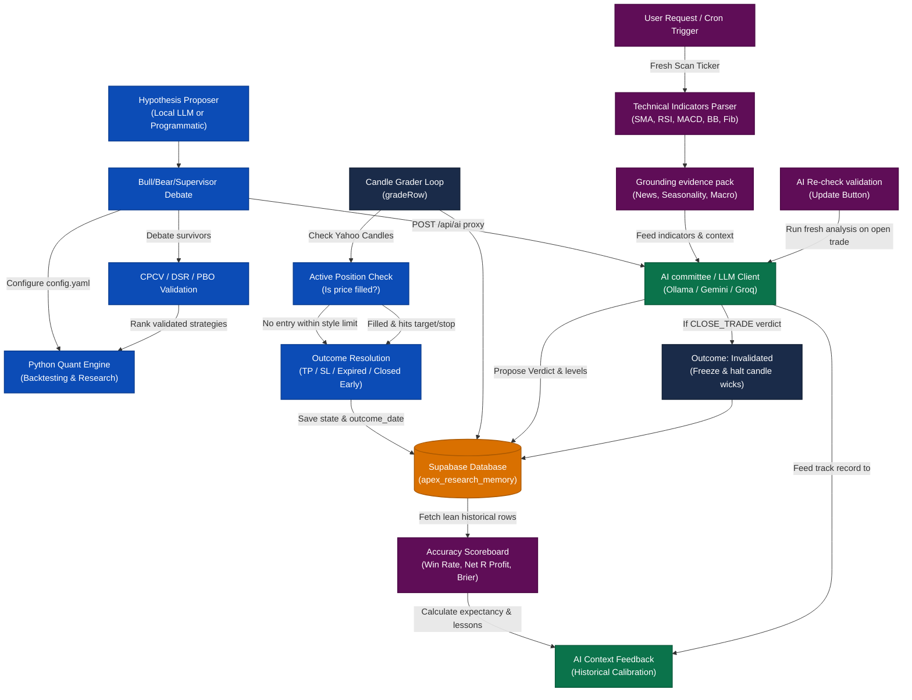

# APEX Quant — System Architecture & Data Flow Diagram

This document contains a comprehensive flow diagram detailing how your automated quant systems, data adapters, live scanner, MT4 execution bridge, and web dashboard interact.

## System Architecture Flowchart

---

## Detailed Component Breakdown

### 1. Ingestion & Pre-Analysis Loop
* **Technical Indicators Parser**: Processes standard wicks, closes, SMAs, MACD, and Bollinger Bands on each candle close.
* **Grounding Evidence Pack**: Bundles external context (news sentiment, macro data, seasonal indices) into the scan prompt.

### 2. Hypothesis & Validation Engine (Python Quant Engine)
* **Debate Loop**: The hypothesis proposer structures potential setups which undergo a simulated supervisor review to prevent biases.
* **CPCV / DSR Validation**: Strategies undergo cross-validation (CPCV) and probability of backtest overfitting (PBO) verification before staging.

### 3. AI Committee Consensus
* **LLM Committee**: Employs real-time LLM validation (Ollama/Gemini/Groq) to confirm the entry thesis, target bounds, and stop levels.
* **Invalidation Trigger**: If a `CLOSE_TRADE` verdict is generated, it immediately triggers an outcome invalidation.

### 4. Outcome Resolution & Scoreboard
* **Candle Grader Loop**: Continuously checks open positions against live market candles.
* **Accuracy Scoreboard**: Pulls logs from Supabase to render win rates, expectancy, Brier score, and calibration curves dynamically on your dashboard.
