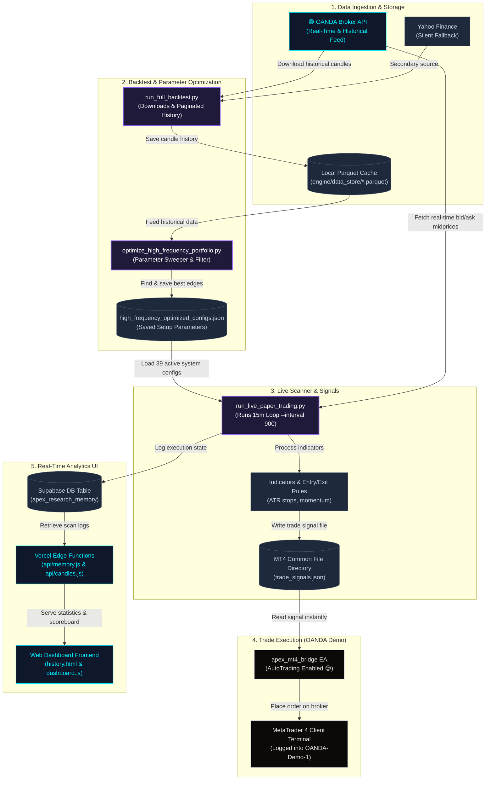

# APEX Quant — System Architecture & Data Flow Diagram

This document contains a comprehensive flow diagram detailing how your automated quant systems, data adapters, live scanner, MT4 execution bridge, and web dashboard interact.

## System Architecture Flowchart

---

## Detailed Component Breakdown

### 1. Data Ingestion & Storage
* **OandaAdapter**: Built to download broker candles. Clamps date ranges below 5,000 candles to avoid API bounds errors and paginates them automatically. It includes a rate-limit protector to avoid OANDA key lockouts.
* **Local Parquet Cache**: Stores raw OHLCV wicks and prices locally on your disk. This eliminates repeated API fetches and makes backtests/sweeps execute instantly.

### 2. Backtest & Parameter Optimization
* **Backtester (`run_full_backtest.py`)**: Runs historical validation over years of data.
* **Optimizer (`optimize_high_frequency_portfolio.py`)**: Scans all parquet files, sweeps momentum, holding, and reward-to-risk combinations, filters out unprofitable systems, and outputs robust configs.

### 3. Live Scanner & Signals
* **Live Bot (`run_live_paper_trading.py`)**: Boots up with your OANDA Demo API credentials, fetches real-time prices, loads the 39 optimized configurations, processes indicator wicks, and writes signals to disk.

### 4. Trade Execution (OANDA Demo)
* **Expert Advisor (`apex_mt4_bridge.mq4`)**: Stays loaded on your MT4 chart. When it sees a fresh trade signal JSON file written by Python, it reads it and routes the buy/sell order to OANDA's practice servers instantly.

### 5. Real-Time Analytics UI
* **Web Dashboard**: Queries Supabase edge-functions. The frontend displays dynamic live broker status badges, loads up to 1,000 resolved trades, paginates cards to avoid UI lag, and features a scoreboard with custom trade count limits.
